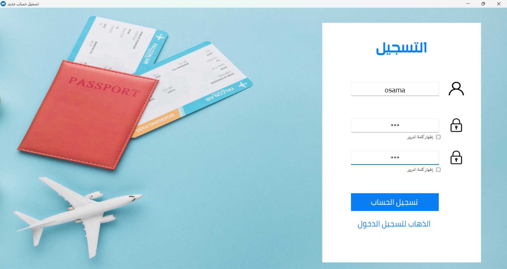
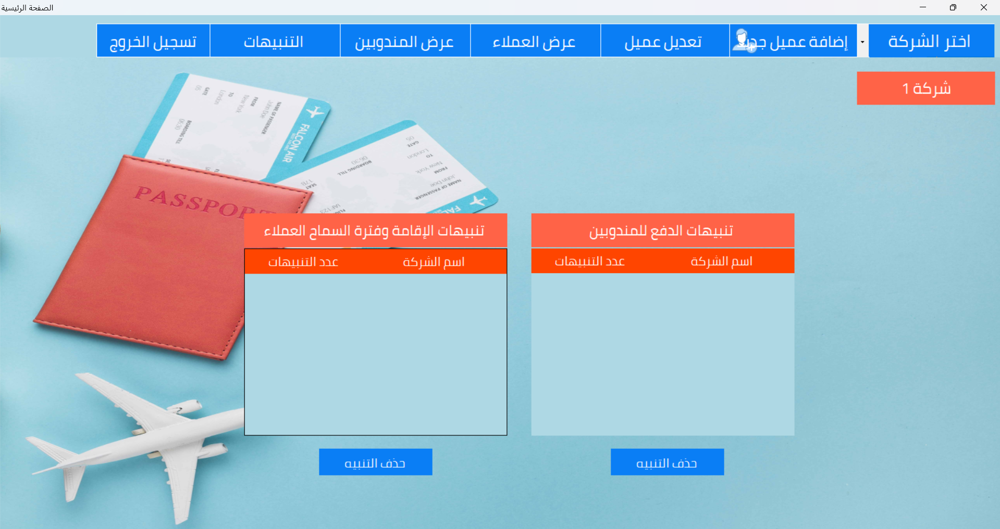
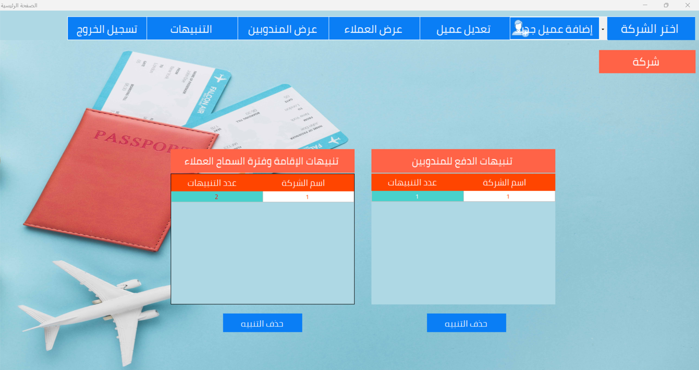
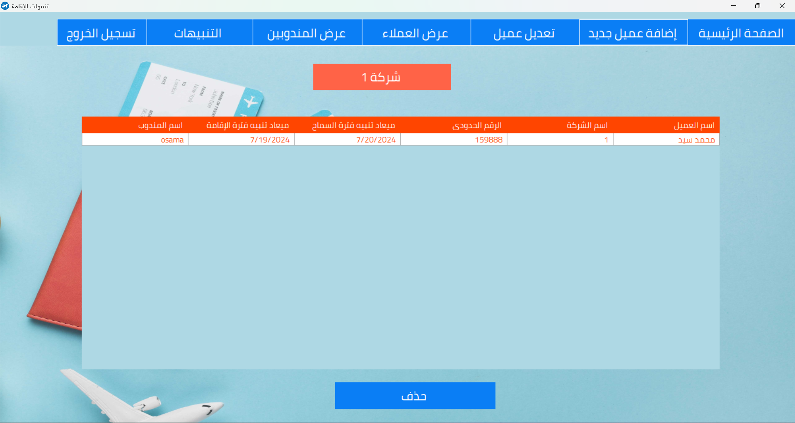

# 🛂 Eqamaa App

**Eqamaa App** is a Windows desktop application developed for a Saudi agency that manages the issuance of residency (Iqama) for expatriates.  
It helps automate operations related to client management, payments, alerts, and reporting.

---

## ✅ Key Features

- 👤 Manage clients and residency information  
- 💰 Track payments, dues, and balances  
- ⏰ Display alerts for expiry dates and grace periods  
- 📋 Manage representatives from travel offices  
- 🔐 Secure login and registration  
- 📊 Generate and print client reports  

---

## 🧰 Tech Stack

- **C#**  
- **ASP.NET (WinForms)**  
- **SQL Server**  
- **ADO.NET**  
- **Local deployment on Windows*

---

## 🖼️ Screenshots

### 🔐 Login Screen
  
> Secure login interface with user validation

---

### 📝 Registration Screen
  
> Create new user accounts with role-based access

---

### 🏠 Home Dashboard
  
> Home page with quick access to key modules and data summaries

  
> Home page that shows Notifications about nearing expiry, late payments, and grace periods

---

### 👤 Add Client
  
> Form to add a new client with personal and residency details

---

### ✏️ Edit Client
  
  
  
> Full control over client data editing and validation

---

### 💸 Payment Alerts
  
> View outstanding balances and notify users about due payments

---

### 🚨 Residency Alerts
  
  
> Alerts for expired or soon-to-expire residency permits

---

### 🧑‍💼 Add Representative
  
> Add travel office reps who manage residency processing

---

### 📝 Edit/View Representatives
  
  
> Manage and review representative details

---

## 🖥️ Getting Started

> This is a desktop application built using WinForms (.NET).  
To run locally:

---

## 📫 Contact

- **Developer:** Osama Saad  
- 📧 osamasaadabuelyazeed@gmail.com  
- 🌐 [Portfolio](https://osama-saad.netlify.app)  
- 💼 [LinkedIn](https://linkedin.com/in/osama-saad98)  
- 💻 [GitHub](https://github.com/osamaabukhaber)

