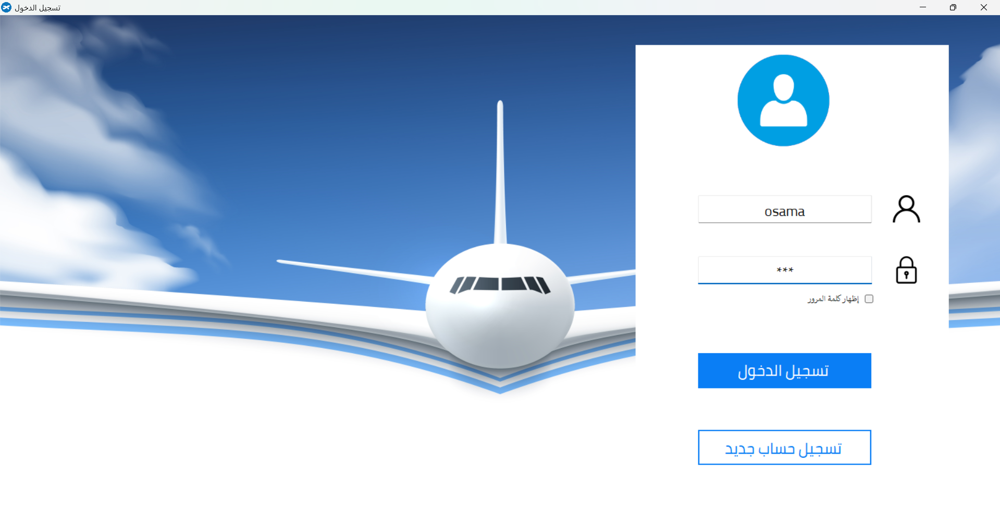

# 🛂 Eqamaa App

**Eqamaa App** is a desktop application developed for a Saudi agency that manages the issuance of residency (Iqama) for expatriates. The system handles client records, payments, and alerts related to residency renewals and grace periods. It was built to automate daily operations and improve efficiency in handling official documents and financial tracking.

---

## ✅ Key Features

- 👤 Manage client information and residency data
- 💵 Record and track payments
- 📄 Generate reports for clients and payment summaries
- ⏰ Alerts for upcoming expiry dates and grace periods
- 🧾 Handle representative data from travel offices
- 🔐 Login and authentication system

---

## 🧰 Tech Stack

- **C#**
- **ASP.NET (WinForms)**
- **SQL Server**
- **ADO.NET / Stored Procedures**
- **Local deployment**

---

## 🖼️ Screenshots

### 🔐 Login Screen

> User authentication with validation

---

### 🧑‍💼 Client Management

> Add, update, and view client details including residency info and national ID

---

### 💰 Payment Tracking

> Record payments, display balances, and view payment history per client

---

### ⏳ Alerts System

> Notifications about nearing expiry, late payments, and grace periods

---

### 📊 Reports

> Generate printable reports for administration or clients

---

## 🚀 Getting Started

> This project is a Windows desktop application built using WinForms. To run it locally:

1. Open the solution in **Visual Studio**
2. Restore NuGet packages (if used)
3. Make sure you have access to the **SQL Server database** with correct connection strings
4. Build and run the application

---

## 📫 Contact

- **Developer:** Osama Saad Abu Elyazeed  
- 📧 osamasaadabuelyazeed@gmail.com  
- 🌐 [Portfolio](https://osama-saad.netlify.app)  
- 💼 [LinkedIn](https://linkedin.com/in/osama-saad98)  
- 💻 [GitHub](https://github.com/osamaabukhaber)

